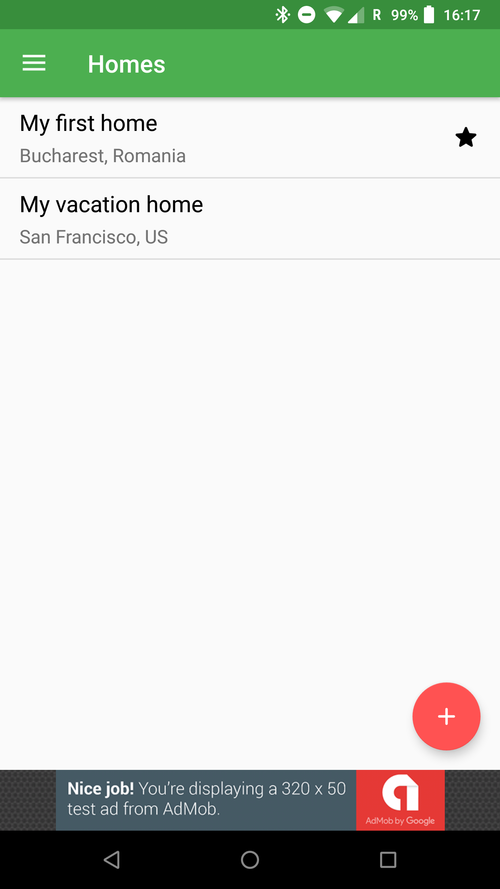
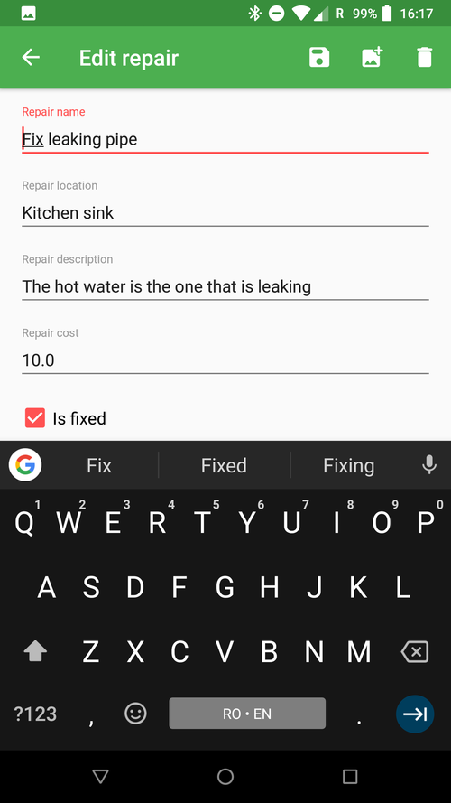

# HappyHomes
Capstone project Submission for Android Developer Nanodegree Program.

## Screenshots



## Libraries
* [AdMob](https://www.google.com/admob/)
* [Android Support Library](https://github.com/JakeWharton/timber)
* [CircularImageView](https://github.com/lopspower/CircularImageView)
* [Glide](https://github.com/bumptech/glide)
* [Firebase Auth](https://firebase.google.com/docs/auth/)
* [Firebase Auth UI](https://github.com/firebase/FirebaseUI-Android)
* [Firebase Database](https://firebase.google.com/docs/database/)
* [Firebase Storage](https://firebase.google.com/docs/storage/)
* [Timber](https://github.com/JakeWharton/timber)

### Firebase rules
```json
{
   "rules":{
      "homes":{
         "$home_id":{
            ".read":"auth != null && data.child('members').child(auth.uid).exists()",
            ".write":"auth != null && (!data.exists() || data.child('members').child(auth.uid).exists())"
         }
      },
      "members":{
         "$member_id":{
            ".read":"$member_id === auth.uid",
            ".write":"$member_id === auth.uid"
         }
      },
      "utilities":{
         "$utility_id":{
            ".read":"auth != null && root.child('homes').child(data.child('home_id').val()).child('members').child(auth.uid).exists()",
            ".write":"auth != null && (!data.exists() || root.child('homes').child(data.child('home_id').val()).child('members').child(auth.uid).exists())"
         }
      },
      "bills":{
         "$bill_id":{
            ".read":"auth.uid != null",
            ".write":"auth.uid != null"
         }
      },
      "repairs":{
         "$repair_id":{
            ".read":"auth != null && root.child('homes').child(data.child('home_id').val()).child('members').child(auth.uid).exists()",
            ".write":"auth != null && (!data.exists() || root.child('homes').child(data.child('home_id').val()).child('members').child(auth.uid).exists())"
         }
      },
      "meters":{
         "$meter_id":{
            ".read":"auth != null && root.child('homes').child(data.child('home_id').val()).child('members').child(auth.uid).exists()",
            ".write":"auth != null && (!data.exists() || root.child('homes').child(data.child('home_id').val()).child('members').child(auth.uid).exists())"
         }
      },
      "readings":{
         ".read":"auth.uid != null",
         ".write":"auth.uid != null"
      }
   }
}
```

## Credits
Icons made by [Freepick](http://www.freepik.com) from [Flaticon](www.flaticon.com) are licensed by [CC 3.0 BY](http://creativecommons.org/licenses/by/3.0/)

## License
See [LICENSE](./LICENSE) for details.
